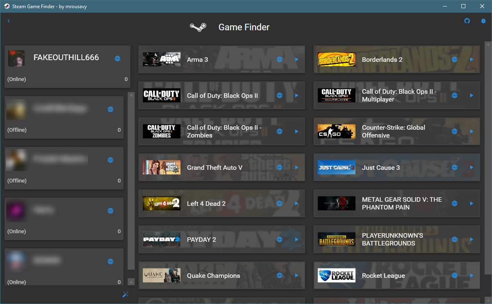
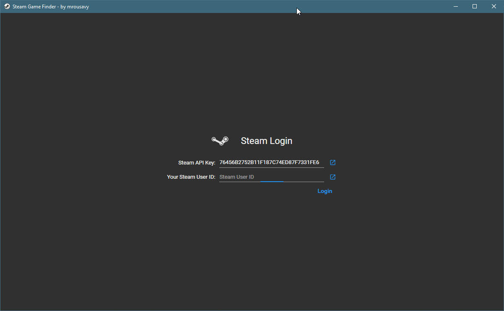

    
    <h1 align="center">GameFinder</h1>
    

        
    

    

        
    

    <blockquote align="center">
    
🎮 An application for finding games to play you and your friends have on Steam

    </blockquote>
    <h2 align="center"><a href="https://github.com/mrousavy/GameFinder/releases/latest">⇩ Download ⇩</a></h2>

Ever felt like not knowing what to play even though you have thousands of games in your steam library? **GameFinder** finds matching games you and your friends have in common.

### Features
* Select friends to compare games with
* View friends details such as avatar, name, online status and profile URL
* View all games you and the selected friends have in common
* Launch games directly from **GameFinder**
* Launch a random game when you can't decide
* Material Design UI

  

    <b>click to show demo GIF</b>
    

        
    

  

  

    

        
    

  

### How to run
##### Pre-compiled
* Download the latest [release](https://github.com/mrousavy/GameFinder/releases/latest)
* Unzip & Run `GameFinder.exe`

##### Manually
* Git clone this repository
* Open `GameFinder.sln` in Visual Studio
* Switch build configuration to `Release`
* Build with <kbd>Ctrl</kbd>+<kbd>Shift</kbd>+<kbd>B</kbd>
* Run the generated `GameFinder.exe` in `bin/Release/`

Fill in your **Steam API Key** (create one [here](https://steamcommunity.com/dev/apikey)), and **your profile's SteamID64** (get it [here](https://steamidfinder.com/)) and make sure that the profiles you select _(including your own)_ **are public and display owned games.**

 
 
 

> Made with C# + WPF MVVM + [Material Design](https://github.com/ButchersBoy/MaterialDesignInXamlToolkit) + [Jellyfish](https://github.com/mrousavy/Jellyfish) + [SteamWebAPI2](https://github.com/babelshift/SteamWebAPI2) | [Icon](http://www.iconarchive.com/show/enkel-icons-by-froyoshark/Steam-icon.html)
